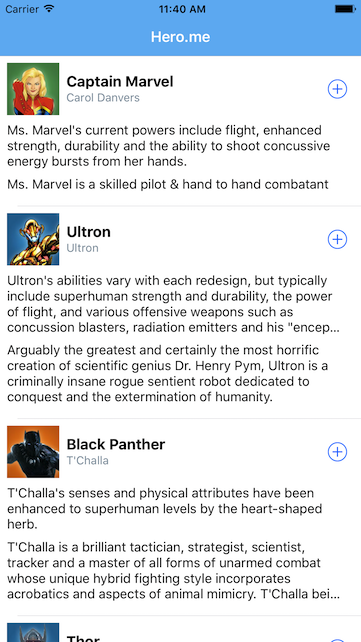

# heroes.me-iOS
A simple app showing heroes information in a table

## Dependencies

It uses Cocoapods as the dependency manager. It depends on SDWebImage and Alamofire.

## Architecture

The project tries to follow a clean architecture:

* The presentation layer is based on MVP. The communication from the presenter to the view (viewcontroller) is trought a protocol.

* The data layer uses an informal repository pattern. Since there´s only one datasource at the moment, the access to the data is directly trough the datasource. If we add a new dataource in the future, the repositiry itself should be created to handle the data access policies.

## Testing

There are some basic tests ilustrating the testability of the architecture